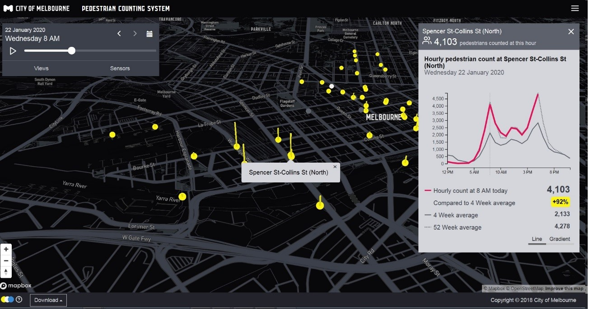
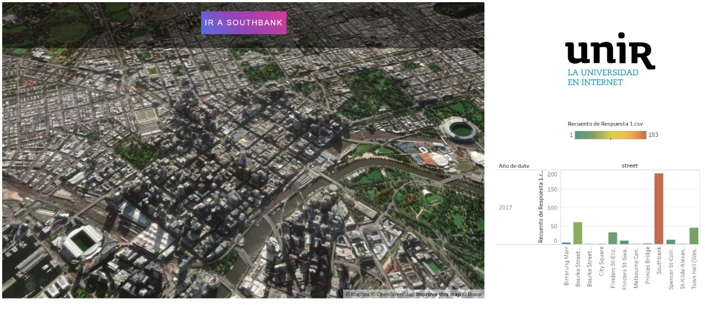
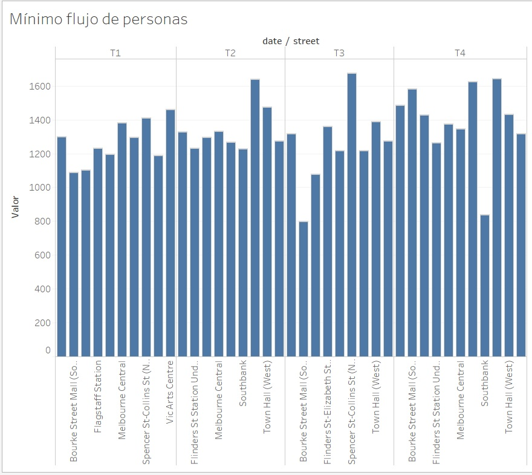

# Proyecto FINTECH UNIR

El flujo de personas en la ciudad es objeto de un creciente interés por parte de empresas y administraciones. Esto se debe a que las dinámicas de la ciudad inciden en su economía. Por ejemplo, las cadenas comerciales, querrán abrir nuevos establecimientos en aquellos emplazamientos que presenten un mayor flujo de personas con perfil de potenciales clientes. Así mismo, la dinámica de las ciudades influye en la movilidad (ej demanda de taxi, Uber…) o la necesidad de infraestructuras e inversiones públicas entre otras cuestiones. La ciudad de Melbourne en Australia dispone de un sistema de aforamiento con datos abiertos http://www.pedestrian.melbourne.vic.gov.au/ que utilizaremos para la siguiente actividad.  

[](http://www.pedestrian.melbourne.vic.gov.au/)


* Descarga datos de flujo de personas en Melbourne de uno o varios meses en formato .csv (o se los puedo proporcionar yo mismo ya descargados).

* El sistema de monitorización de flujo de personas, se inicia como un proyecto piloto en el centro de la ciudad y se espera escalarlo a toda la ciudad (4,9 millones de habitantes). Explica las ventajas o desventajas de utilizar una base de datos SQL/NoSQL para ello. 

* Importa los datos .csv a MongoDB.

* Lanza las queries necesarias para determinar:

-¿En qué calle situarías un negocio que abre todos los días de 10:00h a 21:00h?

-La zona con menor flujo medio de personas para implementar medidas que potencien la zona. 

-…

* Una de las aplicaciones interesantes puede ser analizar el impacto económico de los eventos deportivos en una ciudad (ej. impacto partidos del Athletic en Bilbao https://www.tactizity.com/bilbao, https://reunir.unir.net/handle/123456789/6961 ) o hacer una previsión de la demanda de taxis http://www.smartaxi.me/ entre otras. ¿Qué aplicación se te ocurre que resultaría de interés para tu ciudad?


# SOLUCIÓN:

1.	En primer lugar tenemos que obtener los datos de flujo de personas con los que vamos a trabajar. Son los datos de enero a diciembre de 2017 y se pueden descargar de la web de la ciudad de Melbourne http://www.pedestrian.melbourne.vic.gov.au/

2.	Es necesario importar los documentos a MongoDB. Si tenemos 12 archivos .csv, tendríamos que ejecutar 12 veces el comendo. Para facilitar la tarea, he creado un único archivo con los datos de los 12 meses. "Datos año completo 2017.csv"

El comando a ejecutar para importar el documento .csv es: 

```mongoimport --db test --collection personas --type csv --file Result.csv --headerline```


3.	Ya tenemos los datos en MongoDB, pero no están en el orden en el que nos gustaría en MongoDB. Podemos ordenarlos con el siguiente script. 


```javascript
function getDateStats(d, format = "", separator = "-", utc = false) {
    // print(d);
    if(d == undefined){
        return null;
    }
    if(typeof  d == 'string'){
        var parts = d.split(separator);
        if(format == 'ddmmyy'){
            var dd = new Date(parseInt(parts[2], 10), parseInt(parts[1], 10) - 1, parseInt(parts[0], 10));
        }else if(format == 'mmddyy'){
            var dd = new Date(parseInt(parts[2], 10), parseInt(parts[0], 10) - 1, parseInt(parts[1], 10));
        }
        else{
            var dd = new Date(d);
        }
    }else{
        var dd = new Date(d);
    }
    if(utc){
        var day = dd.getUTCDate();
        var month = dd.getUTCMonth() + 1;
        var year = dd.getUTCFullYear();
    }else{
        var day = dd.getDate();
        var month = dd.getMonth() + 1;
        var year = dd.getFullYear();
    }
    var year_month = year + "-" + month;
    var year_month_day = year + "-" + month + "-" + day;
    var quarters = [{ months: [1, 2, 3] }, { months: [4, 5, 6] }, { months: [7, 8, 9] }, { months: [10, 11, 12] }];
    var halfs = [{ months: [1, 2, 3, 4, 5, 6] }, { months: [7, 8, 9, 10, 11, 12] }];
    var quarter = 0;
    var half = 0;
    quarters.forEach(function(q, counter) {
        counter++;
        if (q.months.indexOf(month) != -1) {
            quarter = counter;
        }
    });
    halfs.forEach(function(h, counter) {
        counter++;
        if (h.months.indexOf(month) != -1) {
            // print(counter);
            half = counter;
        }
    });
    var stats = {
        "day": day,
        "month": month,
        "year": year,
        "quarter": quarter,
        "half": half
    }
    return stats;
}

db.personas.find({})
   .forEach(function(p){
       p.date = getDateStats(p.Date,'mmddyy','/', false);
       p.iso_date = new Date(p.Date);
       db.personas.save(p);
   });
   ```


4.	Para facilitar la tarea proporciono los datos ya ordenados en el fichero Output.json. Lo importamos desde el terminal de Windows.

```mongoimport –db test –collection personas < output.json```

5.	Ahora ya temenos los datos ordenados en MongoDB y podemos lanzar una Query que nos muestre para cada día, la calle en la que ha habido más peatones entre las 10:00h y las 21:00h. 
La Query se ha realizado con la herramienta de gestión visual "NoSQLBooster for MongoDB".

 ```Javascript
// variable that will hold final result
var result = []; 

// Started aggregation pipeline
db.personas.aggregate([
    {							// Utilizamos el comando match para buscar las horas mayores a 10 y menores a 21
        $match: {
            "Hour": { '$gte': 10, '$lte': 21 }
        }
    },
    {
        $group: {
            "_id": { day: '$date.day', month: "$date.month", year: '$date.year' }, // Agrupamos por día, mes y año
            'State Library': { $avg: '$State Library' },			   // Añadimos el valor medio de peatones para cada zona	
            'Collins Place (South)': { $avg: '$Collins Place (South)' },
            'Collins Place (North)': { $avg: '$Collins Place (North)' },
            'Flagstaff Station': { $avg: '$Flagstaff Station' },
            'Melbourne Central': { $avg: '$Melbourne Central' },
            'Town Hall (West)': { $avg: '$Town Hall (West)' },
            'Bourke Street Mall (North)': { $avg: '$Bourke Street Mall (North)' },
            'Bourke Street Mall (South)': { $avg: '$Bourke Street Mall (South)' },
            'Australia on Collins': { $avg: '$Australia on Collins' },
            'Southern Cross Station': { $avg: '$Southern Cross Station' },
            'Victoria Point': { $avg: '$Victoria Point' },
            'New Quay': { $avg: '$New Quay' },
            'Waterfront City': { $avg: '$Waterfront City' },
            'Webb Bridge': { $avg: '$Webb Bridge' },
            'Princes Bridge': { $avg: '$Princes Bridge' },
            'Flinders St Station Underpass': { $avg: '$Flinders St Station Underpass' },
            'Sandridge Bridge': { $avg: '$Sandridge Bridge' },
            'Birrarung Marr': { $avg: '$Birrarung Marr' },
            'QV Market-Elizabeth (West)': { $avg: '$QV Market-Elizabeth (West)' },
            'Flinders St-Elizabeth St (East)': { $avg: '$Flinders St-Elizabeth St (East)' },
            'Spencer St-Collins St (North)': { $avg: '$Spencer St-Collins St (North)' },
            'Spencer St-Collins St (South)': { $avg: '$Spencer St-Collins St (South)' },
            'Bourke St-Russell St (West)': { $avg: '$Bourke St-Russell St (West)' },
            'Convention/Exhibition Centre': { $avg: '$Convention/Exhibition Centre' },
            'Chinatown-Swanston St (North)': { $avg: '$Chinatown-Swanston St (North)' },
            'Chinatown-Lt Bourke St (South)': { $avg: '$Chinatown-Lt Bourke St (South)' },
            'QV Market-Peel St': { $avg: '$QV Market-Peel St' },
            'Vic Arts Centre': { $avg: '$Vic Arts Centre' },
            'Lonsdale St (South)': { $avg: '$Lonsdale St (South)' },
            'Lygon St (West)': { $avg: '$Lygon St (West)' },
            'Flinders St-Spring St (West)': { $avg: '$Flinders St-Spring St (West)' },
            'Flinders St-Spark Lane': { $avg: '$Flinders St-Spark Lane' },
            'Alfred Place': { $avg: '$Alfred Place' },
            'Queen Street (West)': { $avg: '$Queen Street (West)' },
            'Lygon Street (East)': { $avg: '$Lygon Street (East)' },
            'Flinders St-Swanston St (West)': { $avg: '$Flinders St-Swanston St (West)' },
            'Spring St-Lonsdale St (South)': { $avg: '$Spring St-Lonsdale St (South)' },
            'City Square': { $avg: '$City Square' },
            'St-Kilda-Alexandra Gardens': { $avg: '$St-Kilda-Alexandra Gardens' },
            'Grattan St-Swanston St (West)': { $avg: '$Grattan St-Swanston St (West)' },
            'Monash Rd-Swanston St (West)': { $avg: '$Monash Rd-Swanston St (West)' },
            'Tin Alley-Swanston St (West)': { $avg: '$Tin Alley-Swanston St (West)' },
            'Southbank': { $avg: '$Southbank' }
        }
    },
    {
        $sort: {				// Ordenar por año, mes y día para empezar por el  1/1/2017
            "_id.year": 1,
            "_id.month": 1,
            "_id.day": 1,

        }
    }

]).forEach(function(obj) {
    // Cada zoan tiene su media, tenemos que comparar cada campo de la fila 
    // Logica para ordenar

    var averages = [];
    for (var prop in obj) {
        if (prop != "_id") {
            averages.push({ street: prop, avg: obj[prop] })
        }
    }
    averages.sort(function(a, b) {
        if (a.avg > b.avg) return -1;
        if (b.avg > a.avg) return 1;

        return 0;
    });
    result.push({
        date: obj._id.month + '/' + obj._id.day + '/' + obj._id.year,
        street: averages[0].street, // Elegimos el primero (el más alto)
        average: averages[0].avg.toFixed(2)
    })
})

print(result);

 ```
 
 Se proporciona la salida en el archivo “Respuesta.csv”. Si analizamos los datos, nos damos cuenta de que en 193 días del año, la zona en la que transitan más personas es SOUTHBANK. Por tanto, es esta la zona en la que por mayor flujo de personas, situaríamos nuestro negocio.  Para ver los datos de manera gráfica y ver que SOUTHBANK se corresponde con la zona más bulliciosa de negocios de Melbourne, he creado el siguiente mapa que podéis consultar pulsando en el enlace. 
 
# Query 1 Buscar la zona en la que colocaríamos una tienda. 

Como se ve de manera gráfica, la mejor zona es SOUTHBANK. Para representar la información de "Resultado.csv" se ha empleado la herramienta TABLEAU y MAPBOX para la visualización del mapa.  https://public.tableau.com/views/Flujopersonas/Dashboard1?:language=es&:display_count=y&publish=yes?:showVizHome=no#1

[](https://public.tableau.com/views/Flujopersonas/Dashboard1?:language=es&:display_count=y&publish=yes?:showVizHome=no#1)


# Query 2 Buscar la zona más degradada donde menos flujo de personas hay 

En este caso, la Query es más sencilla y no hace falta filtrar por horas. 

 ```
// Variable que almacenará el resultado final
var result = []; 

// Utilizamos el aggregation pipeline
db.personas.aggregate([   
    {
        $group: {
            "_id": { day: '$date.day', month: "$date.month", year: '$date.year' }, // agrupamos los datos por día, mes y año
            'State Library': { $avg: '$State Library' },			   // Add each street average value	
            'Collins Place (South)': { $avg: '$Collins Place (South)' },
            'Collins Place (North)': { $avg: '$Collins Place (North)' },
            'Flagstaff Station': { $avg: '$Flagstaff Station' },
            'Melbourne Central': { $avg: '$Melbourne Central' },
            'Town Hall (West)': { $avg: '$Town Hall (West)' },
            'Bourke Street Mall (North)': { $avg: '$Bourke Street Mall (North)' },
            'Bourke Street Mall (South)': { $avg: '$Bourke Street Mall (South)' },
            'Australia on Collins': { $avg: '$Australia on Collins' },
            'Southern Cross Station': { $avg: '$Southern Cross Station' },
            'Victoria Point': { $avg: '$Victoria Point' },
            'New Quay': { $avg: '$New Quay' },
            'Waterfront City': { $avg: '$Waterfront City' },
            'Webb Bridge': { $avg: '$Webb Bridge' },
            'Princes Bridge': { $avg: '$Princes Bridge' },
            'Flinders St Station Underpass': { $avg: '$Flinders St Station Underpass' },
            'Sandridge Bridge': { $avg: '$Sandridge Bridge' },
            'Birrarung Marr': { $avg: '$Birrarung Marr' },
            'QV Market-Elizabeth (West)': { $avg: '$QV Market-Elizabeth (West)' },
            'Flinders St-Elizabeth St (East)': { $avg: '$Flinders St-Elizabeth St (East)' },
            'Spencer St-Collins St (North)': { $avg: '$Spencer St-Collins St (North)' },
            'Spencer St-Collins St (South)': { $avg: '$Spencer St-Collins St (South)' },
            'Bourke St-Russell St (West)': { $avg: '$Bourke St-Russell St (West)' },
            'Convention/Exhibition Centre': { $avg: '$Convention/Exhibition Centre' },
            'Chinatown-Swanston St (North)': { $avg: '$Chinatown-Swanston St (North)' },
            'Chinatown-Lt Bourke St (South)': { $avg: '$Chinatown-Lt Bourke St (South)' },
            'QV Market-Peel St': { $avg: '$QV Market-Peel St' },
            'Vic Arts Centre': { $avg: '$Vic Arts Centre' },
            'Lonsdale St (South)': { $avg: '$Lonsdale St (South)' },
            'Lygon St (West)': { $avg: '$Lygon St (West)' },
            'Flinders St-Spring St (West)': { $avg: '$Flinders St-Spring St (West)' },
            'Flinders St-Spark Lane': { $avg: '$Flinders St-Spark Lane' },
            'Alfred Place': { $avg: '$Alfred Place' },
            'Queen Street (West)': { $avg: '$Queen Street (West)' },
            'Lygon Street (East)': { $avg: '$Lygon Street (East)' },
            'Flinders St-Swanston St (West)': { $avg: '$Flinders St-Swanston St (West)' },
            'Spring St-Lonsdale St (South)': { $avg: '$Spring St-Lonsdale St (South)' },
            'City Square': { $avg: '$City Square' },
            'St-Kilda-Alexandra Gardens': { $avg: '$St-Kilda-Alexandra Gardens' },
            'Grattan St-Swanston St (West)': { $avg: '$Grattan St-Swanston St (West)' },
            'Monash Rd-Swanston St (West)': { $avg: '$Monash Rd-Swanston St (West)' },
            'Tin Alley-Swanston St (West)': { $avg: '$Tin Alley-Swanston St (West)' },
            'Southbank': { $avg: '$Southbank' }
        }
    },
    {
        $sort: {				// Ordenar los datos por año, mes, día para empezar desde el 1/1/2017
            "_id.year": 1,
            "_id.month": 1,
            "_id.day": 1,

        }
    }

]).forEach(function(obj) {
    // Cada calle tiene su propia media, tenemos que comparar los campos de cada fila
    // Lógica para ordenar los datos 

    var averages = [];
    for (var prop in obj) {
        if (prop != "_id") {
            averages.push({ street: prop, avg: obj[prop] })
        }
    }
    averages.sort(function(a, b) {
        if (a.avg > b.avg) return -1;
        if (b.avg > a.avg) return 1;

        return 0;
    });
    result.push({
        date: obj._id.month + '/' + obj._id.day + '/' + obj._id.year,
        street: averages[34].street, // Cogemos la quinta
        average: averages[34].avg.toFixed(2)
    })
})

print(result);

 ```
 
 El resultado de la Query se encuentra en el archivo "respuesta2.csv"
 
 
[](https://public.tableau.com/views/Flujodepersonasmnimo/Hoja1?:language=es&:display_count=y&publish=yes?:showVizHome=no#1)

